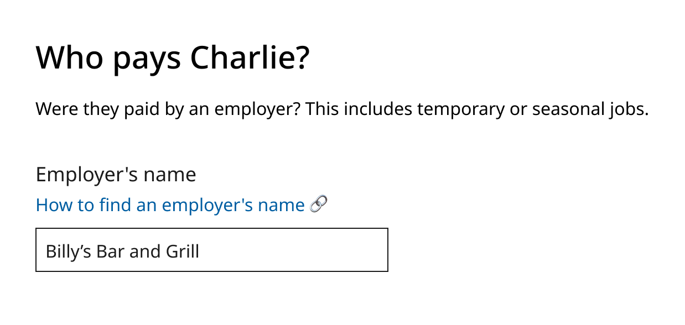
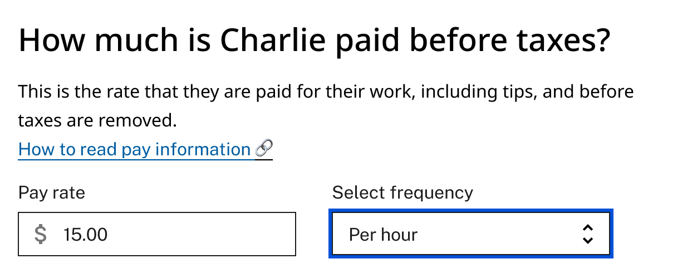
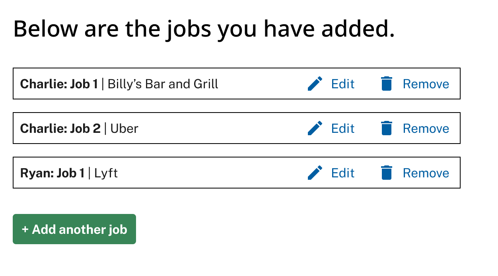

# Improving SNAP Income Reporting

## Introduction 
This toolkit offers guidance and templates to improve the applicant experience of providing income in SNAP applications and renewals. In this toolkit, you’ll find: 
* Recommended practices 
* Common terms and plain language definitions 
* Example language and visual templates for income reporting 

## Who is this guide for? 
This guide is for: 
* SNAP program administrators and their staff 
* Other state, county, and local officials who support the SNAP eligibility and enrollment process 
* Vendors and contractors working with agencies to deliver SNAP benefits to applicants and/or clients 

This guide is not intended to be used by SNAP clients. 

## How can I use the information in this guide? 
* Identifying changes to make to your application/renewal form
* Identifying areas of your application/renewal form to test with clients

## Recommended Practices:
### Have a dedicated “Income” section in your application

  
  Collect income information in one dedicated section. If an application asks all income questions at the same time, the applicant can focus on: 
  <ul>
    <li>Gathering any needed information or documents (like paystubs).</li>
    <li>Entering all income information during one session.</li>
  </ul>
  This helps clients avoid context-switching and encourages them to complete the income section.

### Design for your application to accept a variety of income scenarios

  
  More and more agencies are reporting that clients have “non-traditional” jobs, like gig work or multiple part-time jobs. To prevent burden later in the application or interview process, applications can: 
  <ul>
    <li>Allow clients adding income on a per-job basis, not a per-person basis. This supports scenarios where one member of the household has more than one job.</li>
  </ul>

### Include only the system-required fields when possible

  
  Less fields in a form means less work for applicants. An application should focus on the information that is needed from policy and systems perspectives.
  <ul>
    <li>When asking for sensitive information, be explicit about why it is needed or how it will be used.</li>
    <li>If applicants understand that it will make the process faster or easier, they are incentivized to provide that information.</li>
    <li>For streamlined applications or emergency benefits programs, [TODO: Add more!]</li>
  </ul>

### Avoid using jargon in section titles or as field labels

  
  Income language may include jargon that applicants may not be familiar with. Avoid using this jargon in titles or field labels. Plain language titles or labels give clients confidence they understand the questions. This helps them enter accurate income information. 
  <ul>
    <li>“Gross” and “net” income read as jargon to many clients and can result in inaccurate income reporting. Instead of asking for “gross income,” ask for “pay before taxes.”</li>
    <li>Clarify the term “self-employed” with examples and different terminology. Agencies report that clients don’t always accurately identify as “self-employed.”</li>
  </ul>

### Offer contextual explanations to help meet users where they are

  
  Sometimes using jargon or specific financial terms is unavoidable. 

  Forms can assume the client “knows” what certain terms mean, or what their input should be. Agencies often provide guidance on these terms, but sometimes that guidance is not included in the application. "Helper text" and other in-context descriptions help clients understand what is being asked. This comprehension can result in more accurate income reporting. 
  <ul>
    <li>Imagine if you were explaining the form fields in real life to an applicant. There might be a back-and-forth conversation to interpret the form. Helper text can act like the contextual conversation that would support an applicant.</li>
    <li>When there’s math involved, provide information on what the calculation is. This can help applicants double-check their inputs are accurate.</li>
    <li>Providing examples for what a form should look like when completed can be helpful for clients.</li>
  </ul>

### Use second and third person voice to directly address clients.

  
  Using second-person voice (“you” and their name when possible) is friendly, and can help clients identify when they need to take an action, and can help clarify who the application is referring to.

