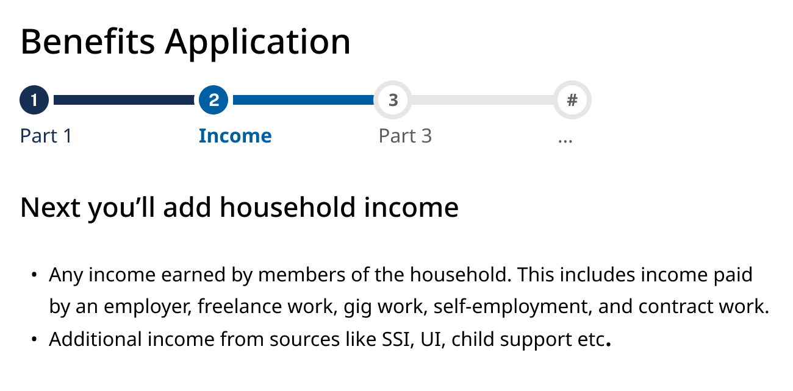
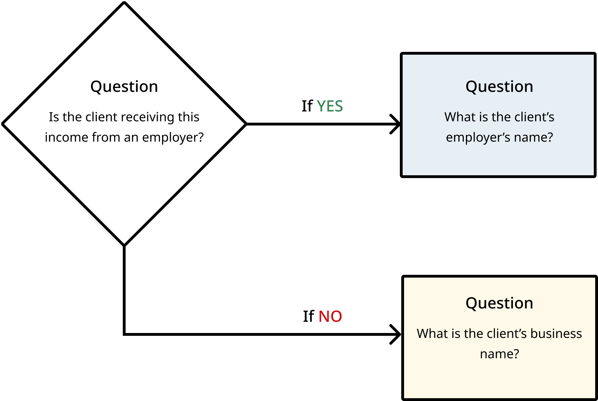
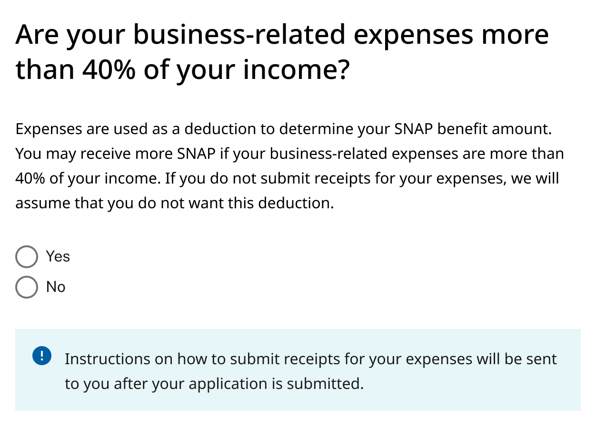

# Improving SNAP Income Reporting

## Background

**_This playbook is \*\*NOT\*\* a source of authoritative, legal, or regulatory guidance and has not been officially endorsed by the Center for Medicaid and CHIP Services (CMCS) or the Food and Nutrition Service (FNS). It is advisory only, and should be adapted appropriately for each state and scenario. Ultimately, it is the responsibility of state Medicaid and Supplemental Nutrition Assistance Program (SNAP) officials to ensure that implementation of any project is compliant with federal Medicaid and SNAP statute and regulations._**

**_Refer to CMCS' [website](https://www.medicaid.gov/medicaid/index.html) and FNS' [website](https://www.fns.usda.gov/snap/supplemental-nutrition-assistance-program) for up-to-date official guidance._**

### Table of Contents

* [Introduction](#introduction)
* [What is plain language?](#what-is-plain-language)
* [Impact of plain language implementations](#impact-of-plain-language-implementations)
* [Recommended best practices](#recommended-practices)
* [Self-attestations and “no income” situations](#self-attestations-and-no-income-situations)
* [Additional improvement areas](#additional-improvement-areas)
* [Considerations for cross-program contexts](#considerations-for-cross-program-contexts)
* [Closing](#closing)
* [Provide Feedback](#provide-feedback)

## Introduction

Eligible people, who have the most need for healthcare, cash assistance, and food assistance are struggling to receive or renew benefits. This struggle is in part due to the burden of income verification. The burden of proof falls on them, not the government service.

The Income Reporting Playbook offers guidance and templates to improve the [client](## "“Client” refers to people applying for or renewing a SNAP benefit.") experience of providing income in SNAP applications and renewals. In this playbook, you’ll find:

* Recommended best practices
* Common terms and plain language definitions
* Example language and visual templates for income

Following this guidance can improve application form accessibility, equity, and usability.

**Who is this playbook for?**

This playbook is a guide for:

* Benefits program administrators and their staff
* Other state, county, and local officials who support benefit eligibility and enrollment process
* Vendors and contractors working with agencies to deliver benefits to clients

This guide is not intended to be used by benefit clients.

**How can I use the information in this guide?**

* Identifying changes to make to your application/renewal forms
* Identifying areas of your application/renewal forms to test with clients

This guide is primarily intended to help improve online application/renewal forms.

## What is plain language?

**Plain language** (also called plain writing or plain English) is communication your audience can understand the first time they read or hear it.

The Plain Writing Act of 2010 defines plain language as "writing that is clear, concise, well-organized, and follows other best practices appropriate to the subject or field and intended audience."

Plain language helps your audience:

* Find what they need
* Understand what they find the first time they read or hear it
* Use what they find to meet their needs

Plain language informs content, but it also informs the organization and layout of content. For income verification, this means that there is opportunity to:

* Refine the written content to support better income reporting
* Refine the organization of the content and sections to promote clarity and prevent context switching when reporting income
* Refine the designs so that the visualization of the content enables clear and simple income reporting

Writing in plain language also improves the output of automated multi-language support tools. However, plain language and automated translations are not a replacement for human translation services.

## Impact of plain language implementations

Implementing plain language will reduce errors by increasing client comprehension and improving the accuracy of income reporting. Research findings from ongoing research will be provided in a future version of this playbook. We have included other plain language research conducted by other organizations working to improve benefits delivery.

**External research references:**

* "Many studies have shown that plain language affects your bottom line—you can save time, personnel resources, and money. And you will give better service to your readers." - <https://www.plainlanguage.gov/about/benefits/>

* "Plain language has helped Insurance (in the Veterans Benefits Administration) by taking the focus off of ourselves and putting it where it belongs, on the customer. The focus on PL let everyone know that is OK to be clear, that we don’t have to hide our message behind big words and bureaucratic language." - [plainlanguage.gov: Quotes, Federal Employees Speak](https://www.plainlanguage.gov/resources/quotes/federal-employees-speak/)

* "It is important to emphasize that agencies should communicate with the public in a way that is clear, simple, meaningful, and jargon-free. A lack of clarity may prevent people from becoming sufficiently aware of programs or services, and the prospect of confusing or complex forms may discourage people from applying for benefits and services for which they are eligible.  Similarly, a lack of clarity may make it difficult for people to understand whether particular requirements apply to them, and if so, what they are supposed to do." - [Final Guidance on Implementing the Plain Writing Act of 2010](https://obamawhitehouse.archives.gov/sites/default/files/omb/memoranda/2011/m11-15.pdf)

* "Next, we zoomed in on the top 20 terms by frequency and examined how different states and territories defined these terms. While we identified some common themes, there were variations in how the terms were defined and applied in context by the states... Too much information can overwhelm the claimant, who may feel lost in all the technicality. On the other hand, too little information does not sufficiently clarify what the term means. Striking an optimal balance with the clear and easy to understand explanation can be challenging...
Based on what we learned from analyzing the existing definitions of the top 20 terms, we concluded that improved plain language definitions are urgently needed for the UI lexicon in order to help claimants understand and navigate the system. " - [DOL's UX Lexicon research findings](https://www.dol.gov/agencies/eta/ui-modernization/use-plain-language/ui-lexicon#:~:text=Creating%20common%2Dsense%20plain%20language%20definitions%20for%20the%20UI%20lexicon%C2%A0)

"Due to the complexity of program rules and eligibility requirements, claimants often have difficulty understanding application questions, which can cause them to inadvertently provide incorrect answers and contributes to improper payments and spikes in call center call volume." - [DOL CX principles for online applications](https://www.dol.gov/agencies/eta/ui-modernization/customer-experience/improve-applications/cx-principles#:~:text=and%20occupation%20sections-,Use%20plain%20language,-Plain%20language%20is)

## Recommended Practices

### Have a dedicated “Income” section in your application

Our research shows that clients do not separate the money their household receives as different types of income. Some agencies, however, have different sections for earned and unearned income in their online applications. Instead, collect income information from all members of the household in one dedicated section. If an application asks all income questions at the same time, the client can focus on:

*Gathering any needed information or documents, like paystubs, to represent everyone in the household's income situation.
*Entering all income information during one session, including income that is not paid by an employer.

[Research done on cognitive load](https://www.nngroup.com/articles/minimize-cognitive-load/) (the mental resources needed for a user to operate a system and complete tasks) shows that usability best practices, such as chunking alike content, helps reduce extraneous cognitive load. Reducing extraneous cognitive load means clients can complete applications faster and with higher accuracy. A simple approach like consolidating income questions into the same section can help clients avoid context-switching and encourages them to complete the income section.

### Design for your application to accept a variety of income scenarios

More and more State administrators are reporting that clients have “non-traditional” jobs, like gig work or multiple part-time jobs. To prevent burden later in the application or interview process, ensure clients can add income on a per-person, then per-job basis. This supports cases where a member of the household has more than one job.

 

### Include only what the agency needs to determine eligibility and calculate benefits

Less fields in a form means less work for clients. An application should focus on the information that is needed from policy and systems perspectives.

* When asking for sensitive information such as social security numbers or citizenship status, be explicit about why it is needed or how it will be used.

* If clients understand that it will make the process faster or easier, they are incentivized to provide that information.

* For emergency benefits programs, provide in-context helper text especially if emergency benefits are evaluated outside of this application.

* Make sure your digital form logic only show the questions the client truly needs based on their previous entries.

* Teams can make a [Question Protocol](https://www.uxmatters.com/mt/archives/2010/06/the-question-protocol-how-to-make-sure-every-form-field-is-necessary.php) to document questions in an application, with the goal of surfacing why they are asking each question. As an exercise, this method helps teams ensure they’re only asking information that serves a purpose. A question protocol diagram example can be seen in [Structuring a complex eligibility form for HealthCare.gov (Nava PBC)](https://www.navapbc.com/insights/structuring-complex-eligibility-form-healthcare).

* A "content-first" design approach can also help ensure only truly necessary information is asked. More guidance on how to use this approach can be found in the Nava PBC toolkit [How to apply a content-first design approach to public services (Nava PBC)](https://www.navapbc.com/toolkits/apply-content-first-design-public-services).

 

### Avoid using jargon in section titles or as field labels

Income language may include jargon that clients may not be familiar with. Avoid using this jargon in titles or field labels. Plain language titles or labels give clients confidence they understand the questions. This helps them enter accurate income information.

* Ongoing research has revealed that “gross” and “net” income read as jargon to many clients and can result in inaccurate income reporting. Instead of asking for “gross income,” ask for “pay before taxes.” In content testing with clients, this terminology helped clients understand the kind of information needed.

* Clarify the term “self-employed” with examples and different terminology. Agencies report that clients don’t always accurately identify as “self-employed.” Research with clients has also showed that clients who work odd jobs or freelance might not view themselves as "self-employed".

Sometimes using jargon or specific financial terms is unavoidable. In these situations, it's important to provide examples or visuals to help convey what information is needed.

Providing examples for what a form or pay statement should look like when completed can be helpful for clients. [How to read a pay stub](https://files.consumerfinance.gov/f/documents/cfpb_building_block_activities_how-to-read-pay-stub_handout.pdf) from consumerfinance.gov provides an example of this type of guidance.

 

### Offer contextual explanations to help meet users where they are

Written content should not assume the client “knows” the agency's definition of certain terms, or that they know the format required to input information. Agencies often provide guidance on these terms, but sometimes that guidance is not included in the application.

* "Helper text" and other contextual descriptions help clients understand what is being asked. This comprehension can result in more accurate income reporting. Imagine if you were explaining the form fields in real life to a client. Helper text can act like the contextual conversation that would support a client's understanding of the questions.
* When there’s math involved, like calculating an average, provide an in-app calculator or information on what the calculation is based on according to the agency's definition. This can help clients double-check their inputs are accurate.
* In-application calendars are also helpful for clients to visualize timelines and their reported dates.

Whenever possible, include helper text within the application so clients don't need to navigate to a different resource. Plainlanguage.gov refers to this recommendation as [minimizing cross-references](https://www.plainlanguage.gov/guidelines/design/minimize-cross-references/).

 

### Use second and third person voice to directly address clients

Using second-person voice (“you” and their name when possible) is friendly, can help clients identify when they need to take an action, and can help clarify who the application is referring to in multi-person households.

 

### Provide beneficial income threshold content upfront

In our research, we heard examples of how itemizing self-employment expenses can reveal clients are within the income threshold. Therefore, for states that offer simplified business-related deductions, it is helpful to give this context to clients.

Note that cost of living expenses such as rent are not covered as part of this guide.

## Lexicon: Common terms and definitions

| Term  | Plain language definition  | Common questions clients have  | References  |
|---|---|---|---|
| Earned income  | Earned income is money you receive from work or a job. This includes wages, salaries, tips, and other taxable pay you earn as an employee or worker. Earned income also includes earnings from self-employment before taxes and other deductions.  | "What is earned income?"   Formal definition:   Earned income includes wages, salaries, tips, and other taxable employee pay. Earned income also includes earnings from self-employment before taxes and other deductions are taken out.  | [Internal Revenue Service](https://itap1.for.irs.gov/owda/0/resource/Commentary_Files_Redirect_ITA/en-US/help/eihave.html) |
| Gross income  | Total pay before taxes and other deductions are taken out.  | "Where can I find this amount?"   Other helpful context:   "This number should be on your paystub. This will be the larger amount listed, before any deductions or taxes are taken out."  | [Consumer Financial Protection Bureau](https://www.consumerfinance.gov/consumer-tools/educator-tools/youth-financial-education/glossary/), Department of Labor  |
| Net income  | Amount of money you receive in your paycheck after taxes and other deductions are taken out; also called take-home pay.  | "Where can I find this amount?"  Other helpful context:   <ul><li> "This is the the amount of money you receive as pay after any deductions or taxes are taken out." </li><li> "This is the smaller number." </li></ul> | [Consumer Financial Protection Bureau](https://www.consumerfinance.gov/consumer-tools/educator-tools/youth-financial-education/glossary/), Department of Labor  |
| Unearned income  | Unearned income is typically money you receive that is not from work or a job. This includes dividends, pension, inheritance, rental income, alimony, and child support.  | "What is unearned income?"   Formal definition:   Unearned income includes unemployment compensation, child support garnishments, taxable social security benefits, pensions, annuities, cancellation of debt, and distributions of unearned income from a trust.   Unearned income also includes investment-type income such as taxable interest, ordinary dividends, and capital gain distributions.  | [Internal Revenue Service](https://itap1.for.irs.gov/owda/0/resource/Commentary_Files_Redirect_ITA/en-US/help/unearn.html)  |
| Self-employment  | You are self-employed if you are trading or conducting business as a sole proprietor, independent contractor, entrepreneur, freelancer, or gig worker. You are also self-employed if you are a member of a partnership, or have an online or part-time business.   Note: Depending on the common types of self-employment jobs in your agency’s jurisdiction, it may be helpful to list specific examples.  | "How do I know if I am self-employed?"   Other helpful context:<ul><li>Examples are very helpful for clients.</li><li>"You are self-employed if you are responsible for paying your income taxes, Medicare, and Social Security taxes yourself instead of an employer taking care of tax withholding for you."</li><li>"Self-employed workers often control the hours they work and also pay for any tools or equipment needed to get the work done."</li></ul>  | [Internal Revenue Service](https://www.irs.gov/businesses/small-businesses-self-employed/self-employed-individuals-tax-center#:~:text=Online%20Learning%20Tools-,Who%20is%20Self%2DEmployed%3F,-Generally%2C%20you%20are)  |
| Tribal income  | For tribal income, include any payments or money from:<ul><li>A tribe for natural resources, usage rights, leases, or royalties </li><li>Natural resources, farming, ranching, fishing, leases, or royalties from Indian trust land including reservations and former reservations</li><li>Selling things with cultural significance, including historical, traditional, religious, or ceremonial importance </li></ul>  | "What counts as income?"   | Facing the Financial Shock Customer Experience Team  |

 

## Self-attestations and “no income” situations

In some cases, it makes sense to ask clients to self-attest to their income, or lack of income. In 2019, Code for America tested a version of [GetCalFresh.org](http://getcalfresh.org/), a digital SNAP application for counties in California, that included an updated, plain language income self-attestation flow: [Overcoming Barriers: Helping Self-Employed Applicants Access Their Full CalFresh Benefit](https://codeforamerica.org/news/helping-self-employed-applicants-access-their-full-calfresh-benefit/). This is a good example of digitizing this process that community-based organizations and caseworkers currently have as part of their administrative burden.

## Additional improvement areas

While the focus of this guide is income reporting in online benefits applications, our research and conversations surfaced a number of other opportunity areas for plain language. These areas are not addressed in this guide:

* Unearned income
* Deductions
* Self-Employment expenses
* Uploading documents or proofs of income
* Renewals/redeterminations (though some of the language in this guide may be applicable in the renewal context)
* Paper applications can benefit from plain language and design pattern recommendations. Agencies should consider their paper form structure and the use of supportive visuals such as tables and hint texts. Some helpful references for improving paper forms are [Civilla's project re:form case study](https://civilla.org/work/project-reform-case-study) and [Gov.uk's form structure guidance](https://www.gov.uk/service-manual/design/form-structure).

## Considerations for cross-program contexts

This guide's focus on plain language, recommended practices, and design patterns may be applicable across many benefit programs. A multi-program application needs to consider policy, system requirements, and other details necessary for the eligibility and enrollment across multiple programs and agencies. This thinking has not been integrated into this guide.

## Closing

This work was developed by the Facing Financial Shock Life Experiences Team. Future projects related to plain language or design patterns may include more income-related guidance.

## Provide Feedback

We’re continuously improving and want to hear from you. Help us by emailing your feedback to
[Income-reporting-project@navapbc.com.](mailto:Income-reporting-project@navapbc.com?subject=[FFS]%20Income%20Reporting%20Project)
