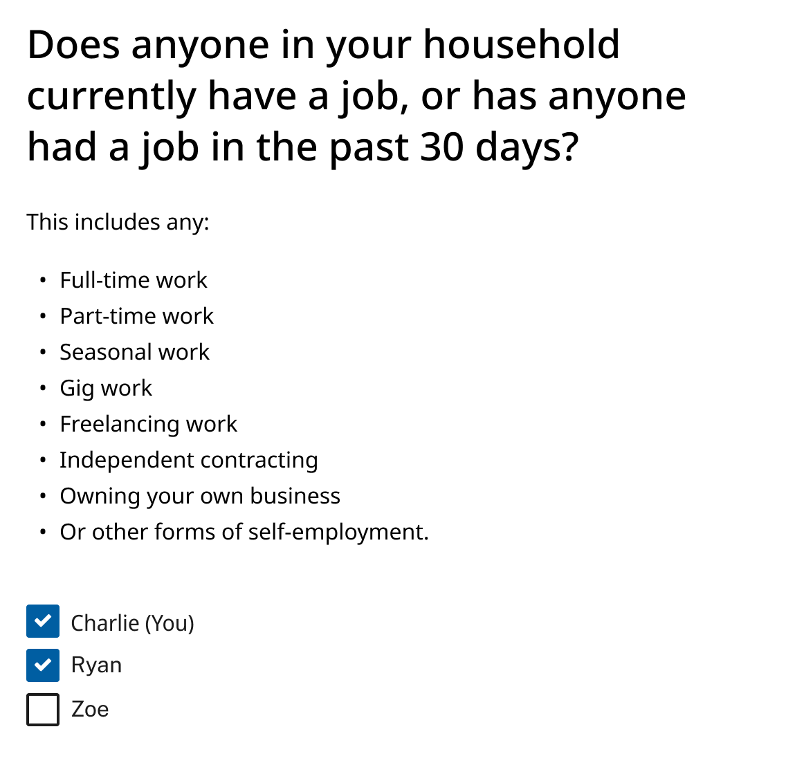
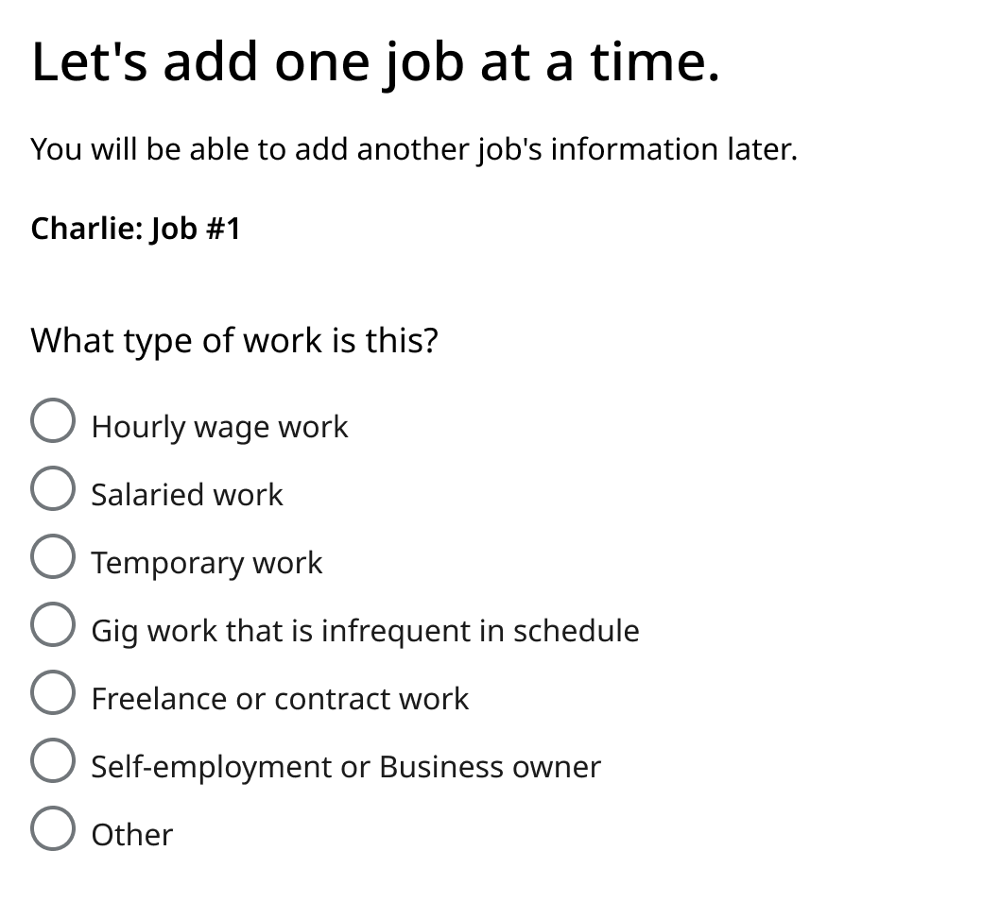

# Improving SNAP Income Reporting

## Introduction 
This toolkit offers guidance and templates to improve the applicant experience of providing income in SNAP applications and renewals. In this toolkit, you’ll find: 
* Recommended practices 
* Common terms and plain language definitions 
* Example language and visual templates for income reporting 

## Who is this guide for? 
This guide is for: 
* SNAP program administrators and their staff 
* Other state, county, and local officials who support the SNAP eligibility and enrollment process 
* Vendors and contractors working with agencies to deliver SNAP benefits to applicants and/or clients 

This guide is not intended to be used by SNAP clients. 

## How can I use the information in this guide? 
* Identifying changes to make to your application/renewal form
* Identifying areas of your application/renewal form to test with clients

## Recommended Practices:
### Have a dedicated “Income” section in your application

  

Collect income information in one dedicated section. If an application asks all income questions at the same time, the applicant can focus on: 
* Gathering any needed information or documents (like paystubs).
* Entering all income information during one session.

This helps clients avoid context-switching and encourages them to complete the income section.

---
### Design for your application to accept a variety of income scenarios

  

More and more agencies are reporting that clients have “non-traditional” jobs, like gig work or multiple part-time jobs. To prevent burden later in the application or interview process, applications can: 
* Allow clients adding income on a per-job basis, not a per-person basis. This supports scenarios where one member of the household has more than one job.

---
