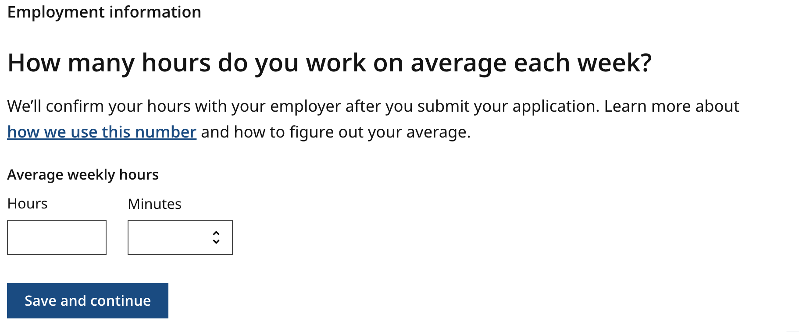

# Improving SNAP Income Reporting

## Background

**_This playbook is \*\*NOT\*\* a source of authoritative, legal, or regulatory guidance and has not been officially endorsed by the Center for Medicaid and CHIP Services (CMCS) or the Food and Nutrition Service (FNS). It is advisory only, and should be adapted appropriately for each state and scenario. Ultimately, it is the responsibility of state Medicaid and Supplemental Nutrition Assistance Program (SNAP) officials to ensure that implementation of any project is compliant with federal Medicaid and SNAP statute and regulations._**

**_Refer to CMCS' [website](https://www.medicaid.gov/medicaid/index.html) and FNS' [website](https://www.fns.usda.gov/snap/supplemental-nutrition-assistance-program) for up-to-date official guidance._**

#### Table of Contents

* [Introduction](#introduction)
* [What is plain language?](#what-is-plain-language)
* [Impact of plain language implementations](#impact-of-plain-language-implementations)
* [Recommended best practices](#recommended-practices)
* [Self-attestations and “no income” situations]()
* [Additional improvement areas]()
* [Considerations for cross-program contexts]()
* [Provide Feedback](#provide-feedback)

## Introduction

Eligible people, who have the most need for healthcare, cash assistance, and food assistance are struggling to receive or renew benefits. This struggle is in part due to the burden of income verification. The burden of proof falls on them, not the government service.

The Income Reporting Playbook offers guidance and templates to improve the [client](## "“Client” refers to people applying for or renewing a SNAP benefit.") experience of providing income in SNAP applications and renewals. In this playbook, you’ll find:

* Recommended best practices
* Common terms and plain language definitions
* Example language and visual templates for income

Following this guidance can improve application form accessibility, equity, and usability.

**Who is this playbook for?**

This playbook is a guide for:

* Benefits program administrators and their staff
* Other state, county, and local officials who support benefit eligibility and enrollment process
* Vendors and contractors working with agencies to deliver benefits to clients

This guide is not intended to be used by benefit clients.

**How can I use the information in this guide?**

* Identifying changes to make to your application/renewal forms
* Identifying areas of your application/renewal forms to test with clients

This guide is primarily intended to help improve online application/renewal forms.

## What is plain language?

**Plain language** (also called plain writing or plain English) is communication your audience can understand the first time they read or hear it.

The Plain Writing Act of 2010 defines plain language as "writing that is clear, concise, well-organized, and follows other best practices appropriate to the subject or field and intended audience."

Plain language helps your audience:

* Find what they need
* Understand what they find the first time they read or hear it
* Use what they find to meet their needs

Plain language informs content, but it also informs the organization and layout of content. For income verification, this means that there is opportunity to:

* Refine the written content to support better income reporting
* Refine the organization of the content and sections to promote clarity and prevent context switching when reporting income
* Refine the designs so that the visualization of the content enables clear and simple income reporting

Writing in plain language also improves the output of automated multi-language support tools. However, plain language and automated translations are not a replacement for human translation services.

## Impact of plain language implementations

Implementing plain language will reduce errors by increasing client comprehension and improving the accuracy of income reporting. Research findings from ongoing research will be provided in a future version of this playbook. We have included other plain language research conducted by other organizations working to improve benefits delivery.

**External research references:**

* "Many studies have shown that plain language affects your bottom line—you can save time, personnel resources, and money. And you will give better service to your readers." - <https://www.plainlanguage.gov/about/benefits/>

* "Plain language has helped Insurance (in the Veterans Benefits Administration) by taking the focus off of ourselves and putting it where it belongs, on the customer. The focus on PL let everyone know that is OK to be clear, that we don’t have to hide our message behind big words and bureaucratic language." - [plainlanguage.gov: Quotes, Federal Employees Speak](https://www.plainlanguage.gov/resources/quotes/federal-employees-speak/)

* "It is important to emphasize that agencies should communicate with the public in a way that is clear, simple, meaningful, and jargon-free. A lack of clarity may prevent people from becoming sufficiently aware of programs or services, and the prospect of confusing or complex forms may discourage people from applying for benefits and services for which they are eligible.  Similarly, a lack of clarity may make it difficult for people to understand whether particular requirements apply to them, and if so, what they are supposed to do." - [Final Guidance on Implementing the Plain Writing Act of 2010](https://obamawhitehouse.archives.gov/sites/default/files/omb/memoranda/2011/m11-15.pdf)

* "Next, we zoomed in on the top 20 terms by frequency and examined how different states and territories defined these terms. While we identified some common themes, there were variations in how the terms were defined and applied in context by the states... Too much information can overwhelm the claimant, who may feel lost in all the technicality. On the other hand, too little information does not sufficiently clarify what the term means. Striking an optimal balance with the clear and easy to understand explanation can be challenging...
Based on what we learned from analyzing the existing definitions of the top 20 terms, we concluded that improved plain language definitions are urgently needed for the UI lexicon in order to help claimants understand and navigate the system. " - [DOL's UX Lexicon research findings](https://www.dol.gov/agencies/eta/ui-modernization/use-plain-language/ui-lexicon#:~:text=Creating%20common%2Dsense%20plain%20language%20definitions%20for%20the%20UI%20lexicon%C2%A0)

"Due to the complexity of program rules and eligibility requirements, claimants often have difficulty understanding application questions, which can cause them to inadvertently provide incorrect answers and contributes to improper payments and spikes in call center call volume." - [DOL CX principles for online applications](https://www.dol.gov/agencies/eta/ui-modernization/customer-experience/improve-applications/cx-principles#:~:text=and%20occupation%20sections-,Use%20plain%20language,-Plain%20language%20is)

## Recommended Practices

### Have a dedicated “Income” section in your application

  Collect income information in one dedicated section. If an application asks all income questions at the same time, the applicant can focus on:

* Gathering any needed information or documents (like paystubs).
* Entering all income information during one session.

This helps clients avoid context-switching and encourages them to complete the income section.

 

### Design for your application to accept a variety of income scenarios

  

  More and more agencies are reporting that clients have “non-traditional” jobs, like gig work or multiple part-time jobs. To prevent burden later in the application or interview process, applications can allow clients adding income on a per-job basis, not a per-person basis. This supports scenarios where one member of the household has more than one job.

 

### Include only the system-required fields when possible

  

  Less fields in a form means less work for applicants. An application should focus on the information that is needed from policy and systems perspectives.

* When asking for sensitive information, be explicit about why it is needed or how it will be used.
* If applicants understand that it will make the process faster or easier, they are incentivized to provide that information.
* For streamlined applications or emergency benefits programs, [TODO: Add more!]

 

### Avoid using jargon in section titles or as field labels

  

  Income language may include jargon that applicants may not be familiar with. Avoid using this jargon in titles or field labels. Plain language titles or labels give clients confidence they understand the questions. This helps them enter accurate income information.

* “Gross” and “net” income read as jargon to many clients and can result in inaccurate income reporting. Instead of asking for “gross income,” ask for “pay before taxes.”
* Clarify the term “self-employed” with examples and different terminology. Agencies report that clients don’t always accurately identify as “self-employed.”

 

### Offer contextual explanations to help meet users where they are

  

  Sometimes using jargon or specific financial terms is unavoidable.

  Forms can assume the client “knows” what certain terms mean, or what their input should be. Agencies often provide guidance on these terms, but sometimes that guidance is not included in the application. "Helper text" and other in-context descriptions help clients understand what is being asked. This comprehension can result in more accurate income reporting.

* Imagine if you were explaining the form fields in real life to an applicant. There might be a back-and-forth conversation to interpret the form. Helper text can act like the contextual conversation that would support an applicant.
* When there’s math involved, provide information on what the calculation is. This can help applicants double-check their inputs are accurate.
* Providing examples for what a form should look like when completed can be helpful for clients.

 

### Use second and third person voice to directly address clients

  

  Using second-person voice (“you” and their name when possible) is friendly, and can help clients identify when they need to take an action, and can help clarify who the application is referring to.

## Provide Feedback

We’re continuously improving and want to hear from you. Help us by emailing your feedback to
[Income-reporting-project@navapbc.com.](mailto:Income-reporting-project@navapbc.com?subject=[FFS]%20Income%20Reporting%20Project)
