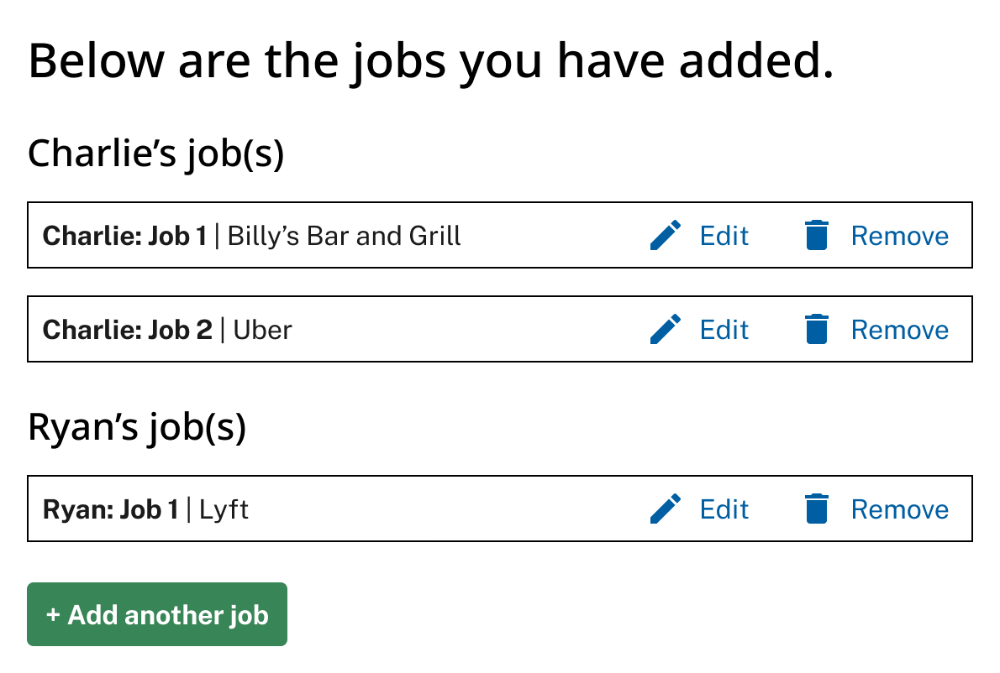

## Design for your application to accept a variety of income scenarios

More and more agencies are reporting that clients have “non-traditional” jobs, like gig work or multiple part-time jobs. To prevent burden later in the application or interview process, applications can: 
* Allow clients adding income on a per-job basis, not a per-person basis. This supports scenarios where one member of the household has more than one job.
